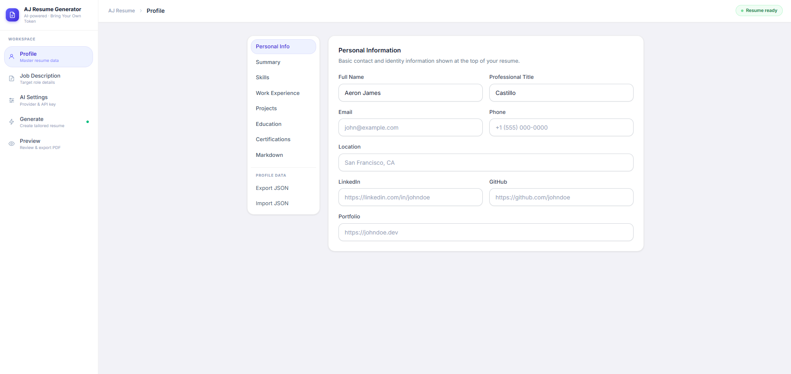
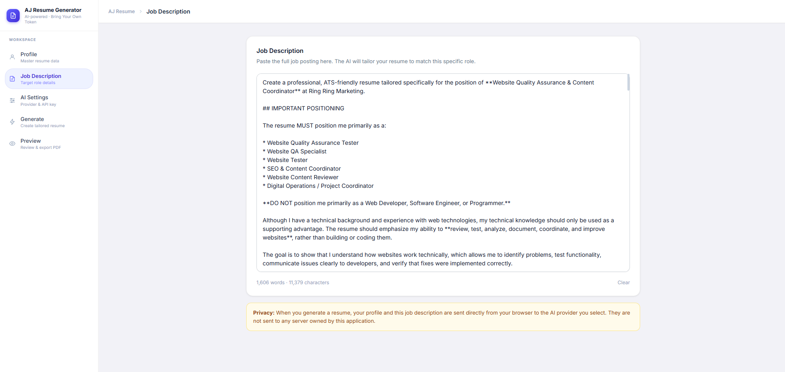
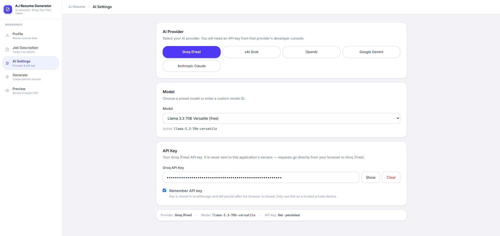
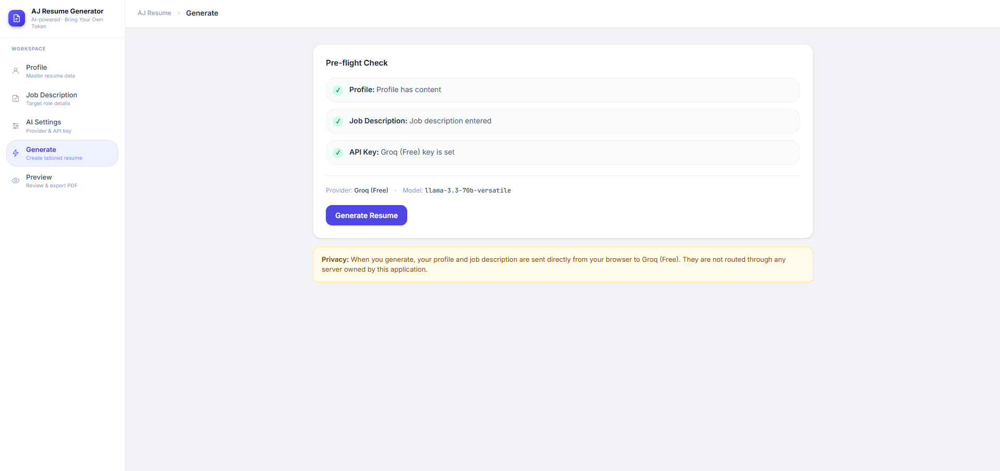
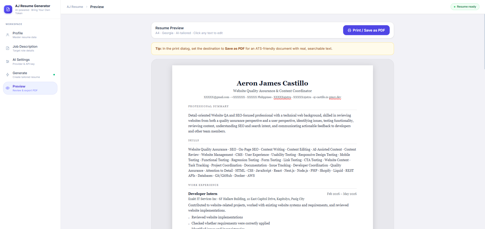

---

A self-hosted, open-source, client-side AI resume generator. Bring your own API key — your data never leaves your browser.

## Features

- **Bring Your Own Token** — API keys are stored only in your browser (sessionStorage by default, localStorage opt-in). Nothing is sent to any server except the AI provider you choose.
- **Multiple AI Providers** — Groq (free), xAI Grok, OpenAI, Google Gemini, Anthropic Claude, or any OpenAI-compatible endpoint via custom model ID.
- **Master Profile** — Build a comprehensive profile once (personal info, summary, skills, work experience, projects, education, certifications). Import/export as JSON.
- **Tailored Resumes** — The AI rewrites your resume to match each specific job description without fabricating information.
- **Editable Preview** — Click any text in the preview to edit it directly before saving.
- **ATS-Friendly PDF** — Print-to-PDF via the browser's native print dialog. Real searchable text — no canvas/image rendering.
- **Self-hostable** — Run locally with `npm run dev` or deploy with Docker in one command.
- **Modern UI** — Clean admin dashboard interface with Inter font, light theme, and responsive mobile layout.

---

## Quick Start

### Local Development

```bash
# Clone the repository
git clone https://github.com/Ajutzu/My-Resume-Generator.git
cd My-Resume-Generator

# Install dependencies
npm install

# Start the development server
npm run dev
```

Open [http://localhost:3000](http://localhost:3000) in your browser.

### Docker (Recommended for Production)

```bash
# Build and start
docker compose up --build

# Run in background
docker compose up -d --build
```

Open [http://localhost:3000](http://localhost:3000). The container runs as a non-root user on Node 20 Alpine.

---

## AI Providers

| Provider | Free Tier | Models | API Key Format |
|---|---|---|---|
| **Groq** | Yes (generous) | Llama 3.3 70B, Llama 3.1 8B, Gemma 2 9B, DeepSeek R1 | `gsk_...` |
| **xAI Grok** | Limited free | Grok 3, Grok 3 Mini, Grok 2 | `xai-...` |
| **OpenAI** | No | GPT-4o, GPT-4o Mini, GPT-4 Turbo | `sk-...` |
| **Google Gemini** | Yes | Gemini 2.0 Flash, 1.5 Pro, 1.5 Flash | `AIza...` |
| **Anthropic** | No | Claude Opus 4, Sonnet 4, Haiku 4 | `sk-ant-...` |

> **Note:** Anthropic's API does not support direct browser requests (CORS restriction). OpenAI, Groq, Gemini, and Grok all work correctly from the browser.

**Recommended for free usage:** Get a Groq API key at [console.groq.com](https://console.groq.com) — no credit card required. Select **Groq (Free)** in AI Settings and use `llama-3.3-70b-versatile`.

---

## How to Use

### 1 — Build your Profile

Go to the **Profile** tab and fill in your information:

- **Personal Info** — name, title, contact details, LinkedIn, GitHub, portfolio
- **Summary** — a brief professional overview (AI will tailor this per job)
- **Skills** — add skills as tags (Enter or comma to add)
- **Work Experience** — accordion list with job title, company, responsibilities, achievements
- **Projects** — personal/professional projects with technologies and contributions
- **Education** — degrees, schools, dates
- **Certifications** — credentials with optional verification URL

Use **Export JSON** to back up your profile, and **Import JSON** to restore it. The **Markdown** tab shows exactly what the AI will receive.



---

### 2 — Paste the Job Description

Go to the **Job Description** tab and paste the full job posting. The more detail you provide, the better the tailoring.



---

### 3 — Configure AI Settings

Go to **AI Settings** and:

1. Select a provider (Groq is recommended for free usage)
2. Choose a model
3. Paste your API key
4. Optionally check **Remember API key** to persist it in localStorage



---

### 4 — Generate

Go to **Generate** and check the pre-flight checklist (profile content, job description, API key). Click **Generate Resume**. Generation typically takes 10–30 seconds depending on the model.



---

### 5 — Preview and Export

Go to **Preview** to see your tailored resume rendered as a real A4 document. You can **click any text to edit it** directly before saving.

Click **Print / Save as PDF** → in the print dialog, set the destination to **Save as PDF** and paper size to **A4**.



---

## Project Structure

```
resume-generator/
├── app/
│   ├── globals.css          # Design tokens, base styles
│   ├── layout.tsx           # Root layout (Inter font)
│   └── page.tsx             # Entry point → AppShell
├── components/
│   ├── AppShell.tsx         # Sidebar + main layout shell
│   ├── ui/
│   │   └── fields.tsx       # Input, Textarea, Field, SectionCard, TagInput
│   ├── profile/             # ProfileEditor + 8 section forms
│   ├── job/                 # JobDescriptionEditor
│   ├── ai/                  # AIConfigEditor
│   ├── generate/            # GeneratePanel (pre-flight + generation)
│   ├── preview/             # ResumePreview + PDF export
│   └── resume/              # ResumeDocument + 7 section renderers
├── lib/
│   ├── types.ts             # TypeScript types
│   ├── storage.ts           # localStorage/sessionStorage (useSyncExternalStore)
│   ├── providers.ts         # AI provider definitions + model lists
│   ├── ai.ts                # AI API calls (browser → provider direct)
│   ├── prompt.ts            # System prompt + user message builders
│   ├── parser.ts            # JSON response parser + fallback merger
│   ├── markdown.ts          # Profile → Markdown converter
│   └── utils.ts             # generateId()
├── images/                  # Screenshots for documentation
├── public/
│   └── gcash-qr.png         # (Add your GCash QR here)
├── Dockerfile               # Multi-stage build (Alpine, non-root)
└── docker-compose.yml       # Single-service compose file
```

## Privacy & Security

- **No backend** — the application is fully client-side. There is no database, no authentication, no server that receives your data.
- **API keys** — stored in `sessionStorage` (cleared on tab close) by default. Opt-in `localStorage` persistence is available per provider. Keys are never logged or transmitted to this application.
- **Profile data** — stored in `localStorage` in your browser. Nothing is synced anywhere.
- **AI requests** — your profile markdown and job description are sent directly from your browser to the AI provider's API. The request path is: `your browser → AI provider`. This application is not in the path.

---

## Docker Details

The `Dockerfile` uses a 3-stage build:

| Stage | Base | Purpose |
|---|---|---|
| `deps` | `node:20-alpine` | Install npm dependencies |
| `builder` | `node:20-alpine` | Build Next.js with `output: standalone` |
| `runner` | `node:20-alpine` | Minimal production image (~100 MB) |

The final image runs as a non-root user (`nextjs:nodejs`, uid/gid 1001).

```bash
# Build image only
docker build -t aj-resume-generator .

# Run directly
docker run -p 3000:3000 aj-resume-generator

# Using compose
docker compose up -d
docker compose down
docker compose logs -f
```

---

## Development

```bash
# Dev server with hot reload
npm run dev

# Type check
npx tsc --noEmit

# Lint
npm run lint

# Production build
npm run build

# Start production server (after build)
npm start
```

**Tech stack:**
- Next.js 16 (App Router, `output: standalone`)
- React 19 (`useSyncExternalStore` for client storage)
- Tailwind CSS v4
- TypeScript (strict)
- Inter font (UI) · Georgia (resume document)

---

## Customization

### Adding a Custom AI Model

In **AI Settings**, select your provider and choose "Custom model ID…" from the model dropdown. Enter any model ID supported by that provider's API.

### Adding a New Provider

1. Add the provider ID to `AIProvider` in `lib/types.ts`
2. Add provider config to `lib/providers.ts`
3. Add a case to `callAI()` in `lib/ai.ts` (reuse `callOpenAICompat` for OpenAI-compatible APIs)

### Changing the Resume Font

Edit the `style` prop in `components/resume/ResumeDocument.tsx`:

```tsx
style={{
  fontFamily: '"Your Font", serif',
  // ...
}}
```

---

## License

This project is licensed under the **MIT License** — see the [LICENSE](LICENSE) file for details.

**You are free to:** use, copy, modify, and distribute this software.

**You must:** keep the original copyright notice and attribution to **Ajutzu** in all copies or substantial portions of the software. You may not claim this project as your own.

> Copyright (c) 2026 Ajutzu
